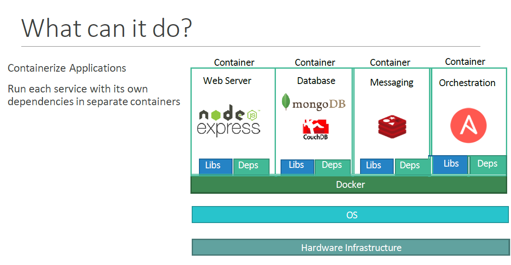
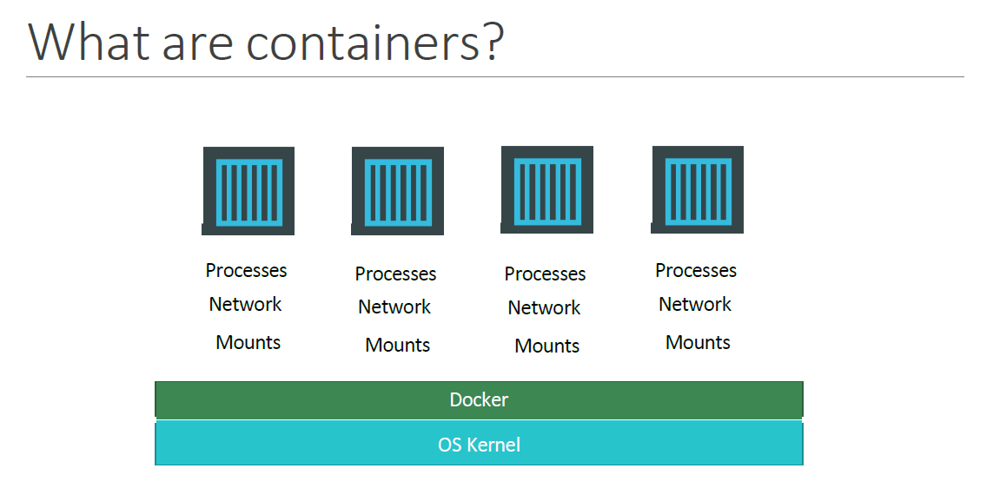
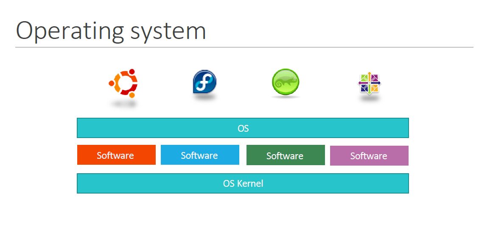
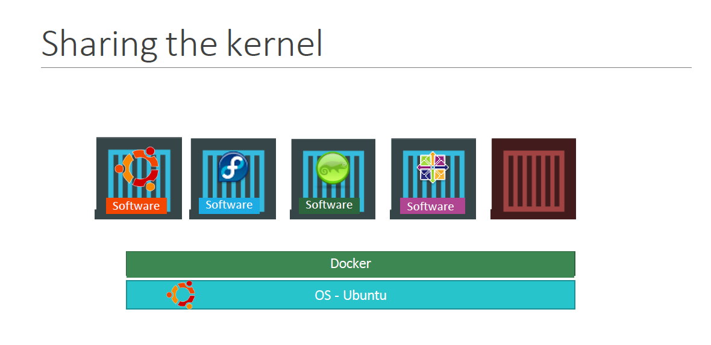
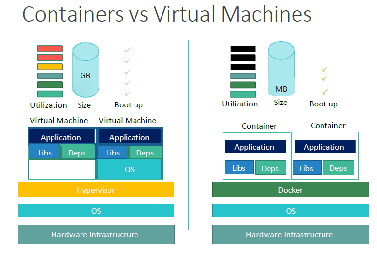
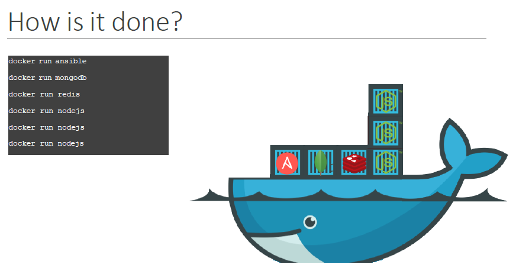

# My-K8s-Journey
Personal study notes for kubernetes

### Kubernetes for the Absolute Beginners personal study notes:
This repository is built to help me and you understand Kubernetes, from the starting day of 11/08/2023 to the day I finish writing this markup.
The repository contains Study-Guide and exercises preparing for Certified Kubernetes Administrator (CKA) exam. the reader should keep in mind that none of these exercises are taken from an actual test. They were creaded based on the study books and labs created by other instructors and book authors.

### Inspiration
Content present in the repository is inspierd by other people' sample exams, training exercises and my own invention. Use links below to check them out

1. Kubernetes for the Absolute Beginners - Hands-on created by Mumshad mannambeth, Kodekloud Training.

# Section 1: Kubernetes Overview

Containers Overview

Why do you need containers ?

Let me start by sharing how I got introduced to Docker. In one of my previous projects, I had this requirement to set up an end to end stack including various different technologies like a web server using node JS and database such as mongoDB and messaging system like Redis and an orchestration tool like ansible. 

We had a lot of issues developing this application with all these different components. 

- First, their compatibility with the underlying operating system. We had to ensure that all these different services were compatible with the version of the operating system we were planning to use.
- There have been times when certain version of these services were not compatible with the OS and we had to go back and look for another OS there was compatible with all these different services. Secondly, we had to check the compatibility between the services and the libraries and dependencies on the OS. We've had issues where one service requires one version of a dependent library whereas another service required another version.

The architecture of our application changed over time. We've had to upgrade to newer version of these components or change the database etc. And every time something changed we had to go through the same process of checking compatibility between these various components and the underlying infrastructure. This compatibility matrix issue is usually referred to as The Matrix from Hell.

Next, everytime we had a new developer on board, we found it really difficult to setup a new environment. The new developers had to follow a large set of instructions and run 100s of commands to finally setup their environments. They had to make sure they were using the right Operating System, the right versions of each of these components and each developer had to set all that up by himself each time.

We also had different development test and production environments. One developer may be comfortable using one OS, and the others may be using another one and so we couldn’t gurantee the application that we were building would run the same way in different environments. And So all of this made our life in developing, building and shipping the application really difficult.

So I needed something that could help us with the compatibility issue. And something that will allow us to modify or change these components without affecting the other components and even modify the underlying operating systems as required. And that search landed me on Docker. With Docker I was able to run each component in a separate container – with its own libraries and its own dependencies. All on the same VM and the OS, but within separate environments or containers. We just had to build the docker configuration once, and all our developers could now get started with a simple “docker run” command. Irrespective of what underlying OS they run, all they needed to do was to make sure they had Docker installed on their systems.

So what are containers?

Containers are completely isolated environments. As in they can have their own processes or services, their own networking interfaces, their own mounts just like virtual machines. Except they all share the same operating system Kernel.

We will look at what that means in a bit. What is also important to note that containers are not new with Docker. 

- Containers have existed for about 10 years now and some of the different types of containers are LXC, LXD, LXCFS etc…
- Docker utilizes LXC containers. Setting up these container environments is hard as they are very low level and that is where a docker offers a high level tool with several powerful functions making it really easy for end users like us.

To understand how docker works, Let us revisit some basic concepts of operating systems first. If you look at operating systems like Ubuntu, fedora, suse or centOS, they all consist of two things. An OS Kernel and a set of software.

The operating system kernel is responsible for interacting with the underlying hardware while the OS kernel remains the same which is Linux in this case, its the software above it that makes these operating systems different.

This software may consist of a different user interface, drivers, compilers, file managers, developer tools etc.. So you have a common Linux kernel shared across all operating systems and some custom software that differentiates operating systems from each other. 

We said earlier that Docker containers share the underlying kernel. What does that actually mean – sharing the kernel? Let’s say we have a system with an Ubuntu OS with Docker installed on it. Docker can run any flavor of OS on top of it as long as they are all based on the same kernel – in this case Linux. If the underlying OS is Ubuntu, docker can run a container based on another distribution like debian, fedora, suse or centos. Each docker container only has the additional software, that we just talked about in the previous slide, that makes these operating systems different and docker utilizes the underlying kernel of the Docker host which works with all Oses above.

So what is an OS that do not share the same kernel as these? Windows ! And so you wont be able to run a windows based container on a Docker host with Linux OS on it. For that you would require docker on a windows server.

You might ask isn’t that a disadvantage then? Not being able to run another kernel on the OS? The answer is No! Because unlike hypervisors, Docker is not meant to virtualize and run different Operating systems and kernels on the same hardware. The main purpose of Docker is to containerize applications and to ship them and run them.

So that brings us to the differences between virtual machines and containers. Something that we tend to do, especially those from a Virtualization.
As you can see on the right, in case of Docker, we have the underlying hardware infrastructure, then the OS, and Docker installed on the OS. Docker then manages the containers that run with libraries and dependencies alone. In case of a Virtual Machine, we have the OS on the underlying hardware, then the Hypervisor like a ESX or virtualization of some kind and then the virtual machines. As you can see each virtual machine has its own OS inside it, then the dependencies and then the application.
This overhead causes higher utilization of underlying resources as there are multiple virtual operating systems and kernel running. The virtual machines also consume higher disk space as each VM is heavy and is usually in Giga Bytes in size, wereas docker containers are lightweight and are usually in Mega Bytes in size.
This allows docker containers to boot up faster, usually in a matter of seconds whereas VMs we know takes minutes to boot up as it needs to bootup the entire OS.

It is also important to note that, Docker has less isolation as more resources are shared between containers like the kernel etc. Whereas VMs have complete isolation from each other. Since VMs don’t rely on the underlying OS or kernel, you can run different types of OS such as linux based or windows based on the same hypervisor.
So these are some differences between the two.

How is it done ?

SO how is it done? There are a lot of containerized versions of applications readily available as of today. So most organizations have their products containerized and available in a public docker registry called dockerhub/or docker store already. For example you can find images of most common operating systems, databases and other services and tools. Once you identify the images you need and you install Docker on your host..
bringing up an application stack, is as easy as running a docker run command with the name of the image. In this case running a docker run ansible command will run an instance of ansible on the docker host. 

Similarly run an instance of mongodb, redis and nodejs using the docker run command. And then when you run nodejs just point to the location of the code repository on the host. If we need to run multiple instances of the web service, simply add as many instances as you need, and configure a load balancer of some kind in the front. In case one of the instances was to fail, simply destroy that instance and launch a new instance. There are other solutions available for handling such cases, that we will look at later during this course.

 