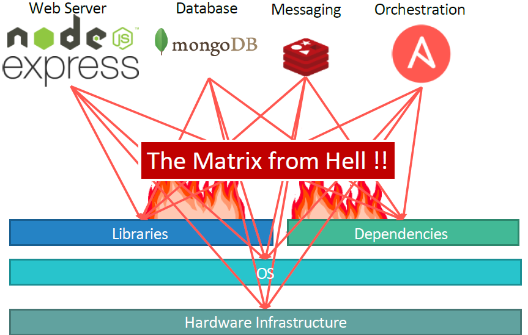

# My-K8s-Journey
Personal study notes for kubernetes

### Kubernetes for the Absolute Beginners personal study notes:
This repository is built to help me and you understand Kubernetes, from the starting day of 11/08/2023 to the day I finish writing this markup.
The repository contains Study-Guide and exercises preparing for Certified Kubernetes Administrator (CKA) exam. the reader should keep in mind that none of these exercises are taken from an actual test. They were creaded based on the study books and labs created by other instructors and book authors.

### Inspiration
Content present in the repository is inspierd by other people' sample exams, training exercises and my own invention. Use links below to check them out

1. Link
2. Link
3. Link

# Section 1: Containers Overview

Why do you need containers ?

Let me start by sharing how I got introduced to Docker. In one of my previous projects, I had this requirement to set up an end to end stack including various different technologies like a web server using node JS and database such as mongoDB and messaging system like Redis and an orchestration tool like ansible. 

We had a lot of issues developing this application with all these different components. 

- First, their compatibility with the underlying operating system. We had to ensure that all these different services were compatible with the version of the operating system we were planning to use.
- There have been times when certain version of these services were not compatible with the OS and we had to go back and look for another OS there was compatible with all these different services. Secondly, we had to check the compatibility between the services and the libraries and dependencies on the OS. We've had issues where one service requires one version of a dependent library whereas another service required another version.

The architecture of our application changed over time. We've had to upgrade to newer version of these components or change the database etc. And every time something changed we had to go through the same process of checking compatibility between these various components and the underlying infrastructure. This compatibility matrix issue is usually referred to as The Matrix from Hell.

