# My-K8s-Journey
Personal study notes for kubernetes

### Kubernetes for the Absolute Beginners personal study notes:
This repository is built to help me and you understand Kubernetes, from the starting day of 11/08/2023 to the day I finish writing this markup.
The repository contains Study-Guide and exercises preparing for Certified Kubernetes Administrator (CKA) exam. the reader should keep in mind that none of these exercises are taken from an actual test. They were creaded based on the study books and labs created by other instructors and book authors.

### Inspiration
Content present in the repository is inspierd by other people' sample exams, training exercises and my own invention. Use links below to check them out

1. The Kubernetes Book by Nigel Poulton.
2. Kubernetes for the Absolute Beginners - Hands-on created by Mumshad mannambeth, Kodekloud Training.

# Section 1: Kubernetes Overview

Kubernetes is an application orchestrator. For the most part, it orchestrates containerized cloud-native microservices apps. That’s a lot of buzzwords, so let’s take some time to
clarify some jargon.

## What is an orchestrator

An orchestrator is a system that deploys and manages applications. It can deploy your
applications and dynamically respond to changes. For example, Kubernetes can:

* Deploy your application
* Scale it up and down dynamically based on demand
* Self-heal it when things break
* Perform zero-downtime rolling updates and rollbacks
* Lots more…

And the best part about Kubernetes… it does all of this orchestration without you having
to supervise or get involved. Obviously, you have to set things up in the first place, but
once you’ve done that, you sit back and let Kubernetes work its magic.

## What is a containerised app

A containerized application is an app that runs in a container.
Before we had containers, applications ran on physical servers or in virtual machines.
Containers are just the next iteration of how we package and run apps. As such, they’re
faster, more lightweight, and more suited to modern business requirements than servers
and virtual machines.

Think of it this way:

* Apps ran on physical servers in the open-systems era (1980s and 1990s)
* Apps ran in virtual machines in the virtualisation era (2000s and into the 2010s)
* Apps run in containers in the cloud-native era (now)

While Kubernetes can orchestrate other workloads, including virtual machines, serverless
functions, and WebAssembly, it’s most commonly used to orchestrate containerised
apps.

## What is a cloud-native app

A cloud-native application is one that’s designed to meet cloud-like demands of autoscaling,
self-healing, rolling updates, rollbacks and more.
It’s important to be clear that cloud-native apps are not applications that will only run
in the public cloud. Yes, they absolutely can run on public clouds, but they can also run
anywhere that you have Kubernetes, even your on-premises datacenters.
So, cloud-native is about the way applications behave and react to events.

## What is a microservices app

A microservices app is built from lots of small, specialised, independent parts that work
together to form a meaningful application. For example, you might have an e-commerce
app comprising all of the following small, specialised, independent components:

* Web front-end 
* Catalog service 
* Shopping cart  
* Authentication service 
* Logging service 
* Persistent store  

As each of these features is developed and deployed as its own small app, or small service,
we call each one a microservice. Typically, each is coded and owned by a different
development team. Each can have its own release cycle and can be scaled independently.
For example, you can patch and scale the shopping cart microservice without affecting
any of the others.

Building applications this way is vital for cloud-native features. For the most part, each microservice runs as a container. Assuming this e-commerce
app with the 6 microservices, there’d be one or more web front-end containers, one or
more catalog containers, one or more shopping cart containers etc. With all of this in mind, let’s re-phrase that definition that was full of buzzwords…
Kubernetes deploys and manages (orchestrates) applications that are packaged and run as containers (containerized) and that are built in ways (cloud-native microservices) that allow them to scale, self-heal, and be updated in-line with modern cloud-like requirements.
We’ll talk about these concepts a lot throughout the book, but for now, this should help
you understand some of the main industry buzzwords.

 Kubernetes background (The Kubernetes Book) 

## Where did Kubernetes come from

Let’s start at the beginning…
Amazon Web Services (AWS) changed the world when it brought us modern cloud
computing. Since then, everyone else has been playing catch-up.
One of the companies trying to catch-up was Google. Google had its own very good
cloud and needed a way to abstract the value of AWS, and make it easier for potential
customers to get off AWS and onto their cloud.
Google also had a lot of experience working with containers at scale. For example,
huge Google applications, such as Search and Gmail, have been running at extreme
scale on containers for a lot of years – since way before Docker brought us easy-to-use
containers. To orchestrate and manage these containerised apps, Google had a couple of
in-house proprietary technologies called Borg and Omega.
Well, Google took the lessons learned from these in-house systems, and created a
new platform called Kubernetes that it donated to the newly formed Cloud Native
Computing Foundation (CNCF) in 2014 as an open-source project.

Kubernetes enables two things Google and the rest of the industry needed:

1. It abstracts underlying infrastructure such as AWS

2. It simplifies moving applications on and off clouds

Since its introduction in 2014, Kubernetes has become the most important cloud-native technology on the planet.

## Kubernetes and Docker

Docker and Kubernetes have worked well together since the beginning of Kubernetes.
Docker builds applications into container images and can run them as containers.
Kubernetes can’t do either of those. Instead, it sits at a higher level and orchestrates
things.

Consider the following quick example. You have a Kubernetes cluster with 10 nodes for
running your production applications. The first step is for your development teams to
use Docker to package their applications as containers. Once this is done you give those
containerised apps to Kubernetes to run. Kubernetes makes high-level orchestration
decisions such as which nodes should run the containers, but Kubernetes itself cannot
start and stop containers. In the past, each Kubernetes cluster node ran a copy of
Docker that would start and stop containers. In this model, the Docker build tools are
used to package applications as containers, Kubernetes makes scheduling and other
orchestration decisions, and the Docker container runtime performs the low-level job
of running containers.

From the outside everything looked good. However, on closer inspection, the Docker
runtime was bloated and overkill for what Kubernetes needed. As a result, the Kubernetes
project began work to make the container runtime layer pluggable so that users
could choose the best runtime for their needs. We’ll get into more detail later in the
book, but in 2016 Kubernetes introduced the container runtime interface (CRI) that
made this container runtime layer pluggable. Since then, lots of different container
runtimes have been developed for Kubernetes.

At the time of writing, containerd (pronounced “container dee”) has replaced Docker
as the default container runtime in most Kubernetes clusters. However, containerd is a
stripped-down version of Docker that’s optimized for Kubernetes. As such, all container
images created by Docker will continue to work on Kubernetes. In fact, both Docker
and Kubernetes work with containers that support the Open Containers Initiative (OCI)
specification.

While all of this is interesting, it’s low-level stuff that shouldn’t impact your Kubernetes
learning experience. For example, no matter which container runtime you use, the
regular Kubernetes commands and patterns will work as normal.

### What about Kubernetes vs Docker Swarm

In 2016 and 2017 we had the orchestrator wars where Docker Swarm, Mesosphere DCOS,
and Kubernetes competed to become the de-facto container orchestrator. To cut a long
story short, Kubernetes won.
However, Docker Swarm is still under active development and is popular with small
companies that need a simple alternative to Kubernetes.

## Kubernetes as the operating system of the cloud

Kubernetes has emerged as the de facto platform for deploying and managing cloudnative
applications. In many ways, it’s like an operating system (OS) for the cloud.

Consider this:

* You install a traditional OS (Linux or Windows) on a server, and it abstracts server resources and schedules application processes

* You install Kubernetes on a cloud, and it abstracts cloud resources and schedules application microservices

In the same way that Linux abstracts the hardware differences between server platforms, Kubernetes abstracts the differences between different private and public clouds. Net
result… as long as you’re running Kubernetes, it doesn’t matter if the underlying infrastructure is on premises in your own datacenters, or in the public cloud.

With this in mind, Kubernetes is a major step towards a true hybrid cloud, allowing you to seamlessly move and balance workloads across multiple different public and private
cloud infrastructures. You can also migrate to and from different clouds, meaning you
can choose one cloud today and switch to a different one in the future.

### Cloud scale

Generally speaking, cloud-native microservices applications make our previous
scalability and complexity challenges look easy – we’ve just said Google goes through
billions of containers every week!
That’s great, but most of us are nothing like Google.
Well, as a general rule, if your legacy apps have hundreds of VMs, there’s a good chance
your containerized cloud-native microservices apps will have thousands of containers.
With this in mind, you’ll need help managing them.
Say hello to Kubernetes.
Also, we live in a business and technology world that’s increasingly fragmented and
constantly in a state of disruption. With this in mind, we desperately need a framework
and platform that is widely accepted and hides complexity.
Again, say hello to Kubernetes.

### Application scheduling

A typical computer is a collection of CPU, memory, storage, and networking. But
modern operating systems have done a great job abstracting that. For example, how
many developers care which CPU core or exact memory address their application uses?
Not many, we let the OS take care of things like that. And it’s a good thing as it makes
the world of application development a far friendlier place.
Kubernetes does a similar thing with cloud and datacenter resources. At a high-level, a
cloud or datacenter is a pool of compute, network, and storage resources. Kubernetes
abstracts them, meaning you don’t have to hard code which node or storage volume
your applications run on, you don’t even have to care which cloud they run on. Kubernetes
takes care of all that.
So, gone are the days of naming your servers, mapping storage volumes and IP addresses
in spreadsheets, and otherwise treating your infrastructure assets like pets. Modern
cloud-native apps don’t usually care. In the cloud-native world, we just say “Hey
Kubernetes, here’s an app. Please deploy it and make sure it keeps running…“.

Containers Overview

## Why do you need containers ?

Let me start by sharing how I got introduced to Docker. In one of my previous projects, I had this requirement to set up an end to end stack including various different technologies like a web server using node JS and database such as mongoDB and messaging system like Redis and an orchestration tool like ansible. 

We had a lot of issues developing this application with all these different components. 

* First, their compatibility with the underlying operating system. We had to ensure that all these different services were compatible with the version of the operating system we were planning to use.

* There have been times when certain version of these services were not compatible with the OS and we had to go back and look for another OS there was compatible with all these different services. Secondly, we had to check the compatibility between the services and the libraries and dependencies on the OS. We've had issues where one service requires one version of a dependent library whereas another service required another version.

The architecture of our application changed over time. We've had to upgrade to newer version of these components or change the database etc. And every time something changed we had to go through the same process of checking compatibility between these various components and the underlying infrastructure. This compatibility matrix issue is usually referred to as The Matrix from Hell.

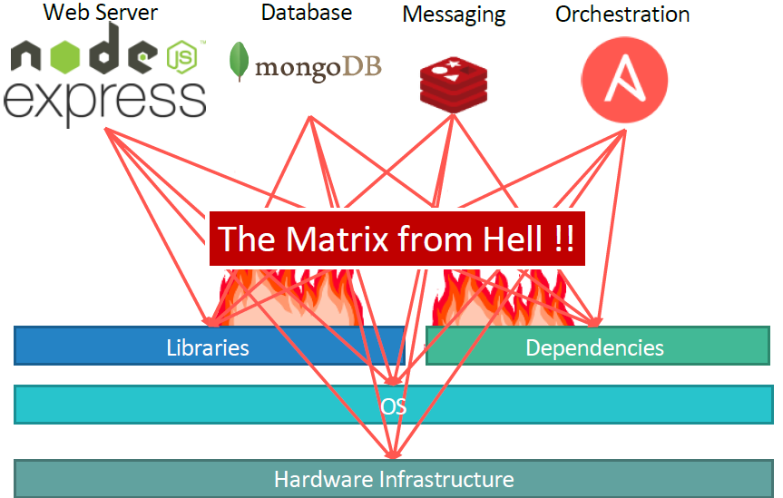

Next, everytime we had a new developer on board, we found it really difficult to setup a new environment. The new developers had to follow a large set of instructions and run 100s of commands to finally setup their environments. They had to make sure they were using the right Operating System, the right versions of each of these components and each developer had to set all that up by himself each time.

We also had different development test and production environments. One developer may be comfortable using one OS, and the others may be using another one and so we couldn’t gurantee the application that we were building would run the same way in different environments. And So all of this made our life in developing, building and shipping the application really difficult.

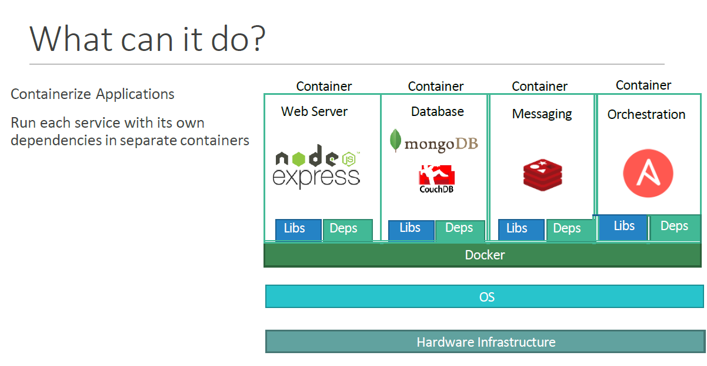

So I needed something that could help us with the compatibility issue. And something that will allow us to modify or change these components without affecting the other components and even modify the underlying operating systems as required. And that search landed me on Docker. With Docker I was able to run each component in a separate container – with its own libraries and its own dependencies. All on the same VM and the OS, but within separate environments or containers. We just had to build the docker configuration once, and all our developers could now get started with a simple “docker run” command. Irrespective of what underlying OS they run, all they needed to do was to make sure they had Docker installed on their systems.

## So what are containers?

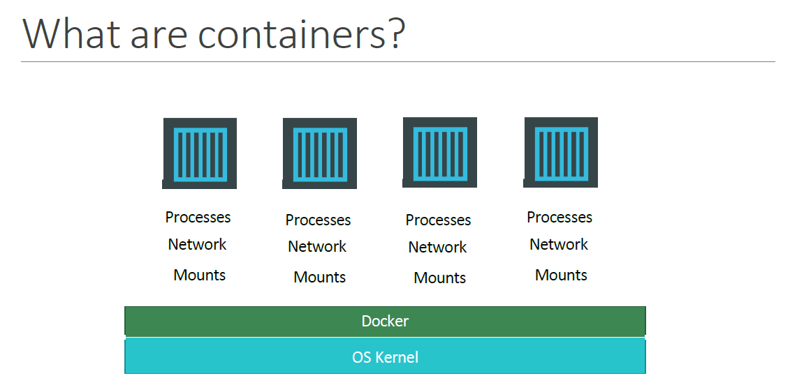

Containers are completely isolated environments. As in they can have their own processes or services, their own networking interfaces, their own mounts just like virtual machines. Except they all share the same operating system Kernel.

We will look at what that means in a bit. What is also important to note that containers are not new with Docker. 

* Containers have existed for about 10 years now and some of the different types of containers are LXC, LXD, LXCFS etc…
* Docker utilizes LXC containers. Setting up these container environments is hard as they are very low level and that is where a docker offers a high level tool with several powerful functions making it really easy for end users like us.

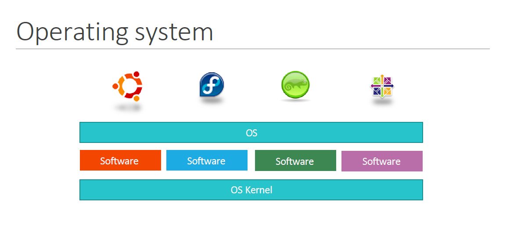

To understand how docker works, Let us revisit some basic concepts of operating systems first. If you look at operating systems like Ubuntu, fedora, suse or centOS, they all consist of two things. An OS Kernel and a set of software.

The operating system kernel is responsible for interacting with the underlying hardware while the OS kernel remains the same which is Linux in this case, its the software above it that makes these operating systems different.

This software may consist of a different user interface, drivers, compilers, file managers, developer tools etc.. So you have a common Linux kernel shared across all operating systems and some custom software that differentiates operating systems from each other. 

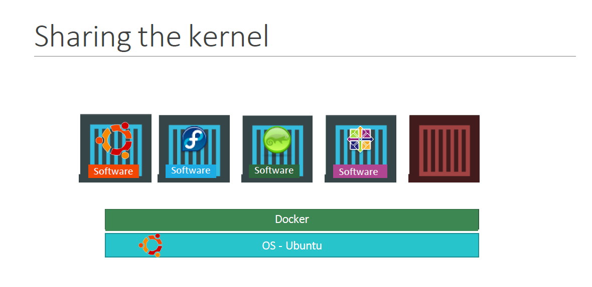

We said earlier that Docker containers share the underlying kernel. What does that actually mean – sharing the kernel? Let’s say we have a system with an Ubuntu OS with Docker installed on it. Docker can run any flavor of OS on top of it as long as they are all based on the same kernel – in this case Linux. If the underlying OS is Ubuntu, docker can run a container based on another distribution like debian, fedora, suse or centos. Each docker container only has the additional software, that we just talked about in the previous slide, that makes these operating systems different and docker utilizes the underlying kernel of the Docker host which works with all Oses above.

So what is an OS that do not share the same kernel as these? Windows ! And so you wont be able to run a windows based container on a Docker host with Linux OS on it. For that you would require docker on a windows server.

You might ask isn’t that a disadvantage then? Not being able to run another kernel on the OS? The answer is No! Because unlike hypervisors, Docker is not meant to virtualize and run different Operating systems and kernels on the same hardware. The main purpose of Docker is to containerize applications and to ship them and run them.

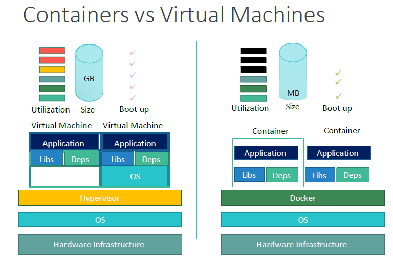

So that brings us to the differences between virtual machines and containers. Something that we tend to do, especially those from a Virtualization.
As you can see on the right, in case of Docker, we have the underlying hardware infrastructure, then the OS, and Docker installed on the OS. Docker then manages the containers that run with libraries and dependencies alone. In case of a Virtual Machine, we have the OS on the underlying hardware, then the Hypervisor like a ESX or virtualization of some kind and then the virtual machines. As you can see each virtual machine has its own OS inside it, then the dependencies and then the application.
This overhead causes higher utilization of underlying resources as there are multiple virtual operating systems and kernel running. The virtual machines also consume higher disk space as each VM is heavy and is usually in Giga Bytes in size, wereas docker containers are lightweight and are usually in Mega Bytes in size.
This allows docker containers to boot up faster, usually in a matter of seconds whereas VMs we know takes minutes to boot up as it needs to bootup the entire OS.

It is also important to note that, Docker has less isolation as more resources are shared between containers like the kernel etc. Whereas VMs have complete isolation from each other. Since VMs don’t rely on the underlying OS or kernel, you can run different types of OS such as linux based or windows based on the same hypervisor.
So these are some differences between the two.

## How is it done ?

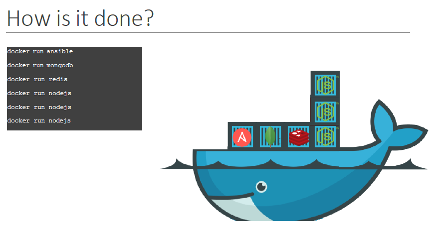

SO how is it done? There are a lot of containerized versions of applications readily available as of today. So most organizations have their products containerized and available in a public docker registry called dockerhub/or docker store already. For example you can find images of most common operating systems, databases and other services and tools. Once you identify the images you need and you install Docker on your host..
bringing up an application stack, is as easy as running a docker run command with the name of the image. In this case running a docker run ansible command will run an instance of ansible on the docker host. 

Similarly run an instance of mongodb, redis and nodejs using the docker run command. And then when you run nodejs just point to the location of the code repository on the host. If we need to run multiple instances of the web service, simply add as many instances as you need, and configure a load balancer of some kind in the front. In case one of the instances was to fail, simply destroy that instance and launch a new instance. There are other solutions available for handling such cases, that we will look at later during this course.

## Container vs Image

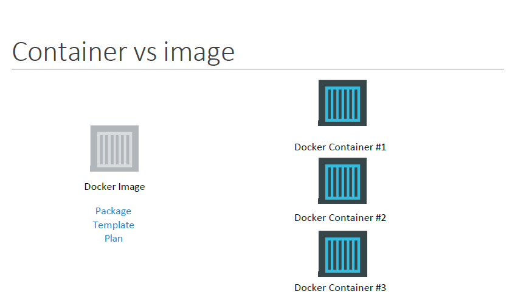

We have been talking about images and containers. Let’s understand the difference
between the two.

An image is a package or a template, just like a VM template that you might have worked with in the virtualization world. It is used to create one or more containers.

Containers are running instances off images that are isolated and have their own environments and set of processes
As we have seen before a lot of products have been dockerized already. In case you cannot find what you are looking for you could create an image yourself and push it to the Docker hub repository making it available for public.

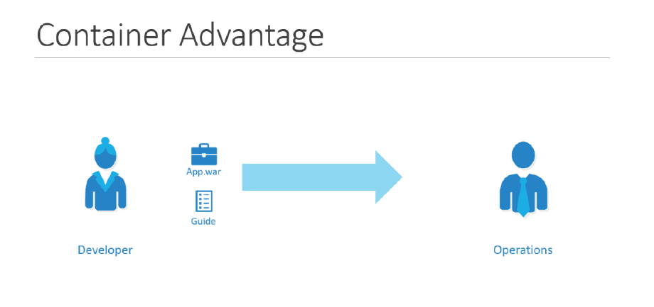

If you look at it, traditionally developers developed applications. Then they hand it over to Ops team to deploy and manage it in production environments. They do that by providing a set of instructions such as information about how the hosts must be setup, what pre-requisites are to be installed on the host and how the dependencies are to be configured etc. Since the Ops team did not develop the application on their own, they struggle with setting it up. When they hit an issue, they work with the developers to resolve it.

With Docker, a major portion of work involved in setting up the infrastructure is now in the hands of the developers in the form of a Docker file. The guide that the developers built previously to setup the infrastructure can now easily put together into a Dockerfile to create an image for their applications. This image can now run on any container platform and is guaranteed to run the same way everywhere. So the Ops team now can simply use the image to deploy the application. Since the image was already working when the developer built it and operations are not modifying it, it continues to work the same when deployed in production.

Container Orchestration

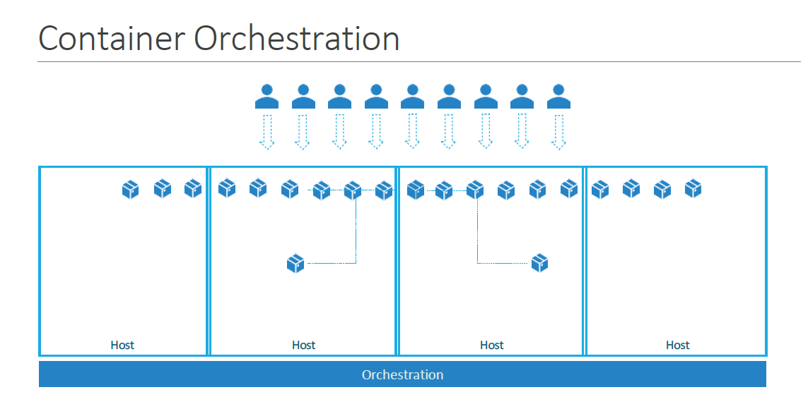

So we learned about containers and we now have our application packaged into a docker container. But what next? How do you run it in production? What if your application relies on other containers such as database or messaging services or other backend services? What if the number of users increase and you need to scale your application? You would also like to scale down when the load decreases.
To enable these functionalities you need an underlying platform with a set of resources. The platform needs to orchestrate the connectivity between the containers and automatically scale up or down based on the load. This whole process of automatically deploying and managing containers is known as Container Orchestration.

## Orchestration Technologies

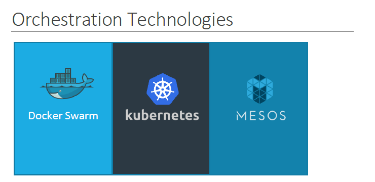

Kubernetes is thus a container orchestration technology. There are multiple such technologies available today – Docker has its own tool called Docker Swarm.
Kubernetes from Google and Mesos from Apache. While Docker Swarm is really easy to setup and get started, it lacks some of the advanced autoscaling features required for complex applications. Mesos on the other hand is quite difficult to setup and get started, but supports many advanced features. Kubernetes - arguably the most popular of it all – is a bit difficult to setup and get started but provides a lot of options to customize deployments and supports deployment of complex architectures.
Kubernetes is now supported on all public cloud service providers like GCP, Azure and
AWS and the kubernetes project is one of the top ranked projects in Github.

## Kubernetes Advantage

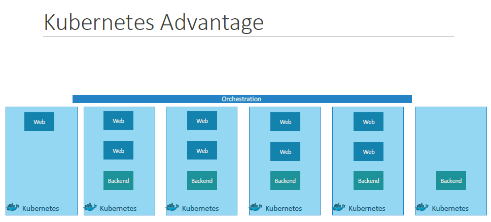

There are various advantages of container orchestration. Your application is now highly available as hardware failures do not bring your application down because you have multiple instances of your application running on different nodes. The user traffic is load balanced across the various containers. When demand increases, deploy more instances of the application seamlessly and within a matter of second and we have the ability to do that at a service level. When we run out of hardware resources, scale the number of nodes up/down without having to take down the application. And do all of these easily with a set of declarative object configuration files.

And THAT IS Kubernetes. Kubernetes is a container Orchestration technology used to orchestrate the deployment and management of 100s and 1000s of containers in a clustered environment. 

Kubernetes Architecture

Before we head into setting up a kubernetes cluster, it is important to understand some of the basic concepts. This is to make sense of the terms that we will come across while setting up a kubernetes cluster.

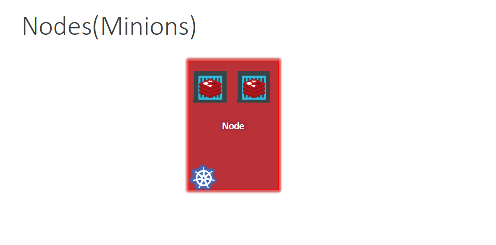

Let us start with Nodes. A node is a machine – physical or virtual – on which kubernetes is installed. A node is a worker machine and this is were containers will be launched by kubernetes.

It was also known as Minions in the past. So you might here these terms used inter changeably. But what if the node on which our application is running fails? Well, obviously our application goes down. So you need to have more than one nodes.

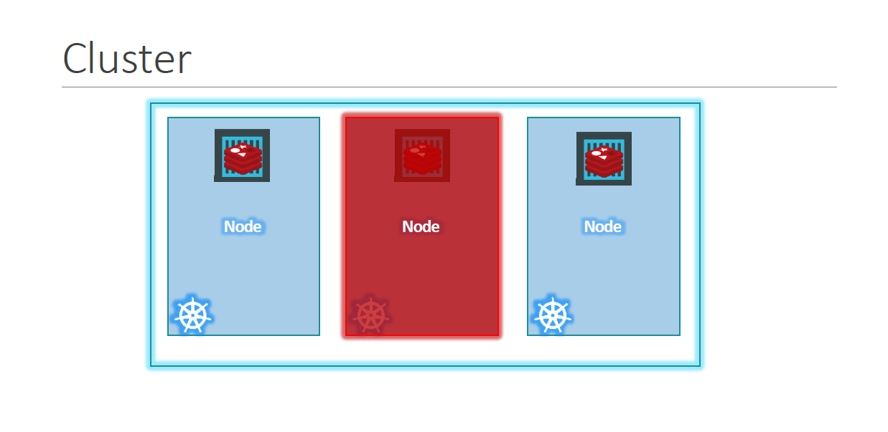

A cluster is a set of nodes grouped together. This way even if one node fails you have your application still accessible from the other nodes. Moreover having multiple nodes helps in sharing load as well.

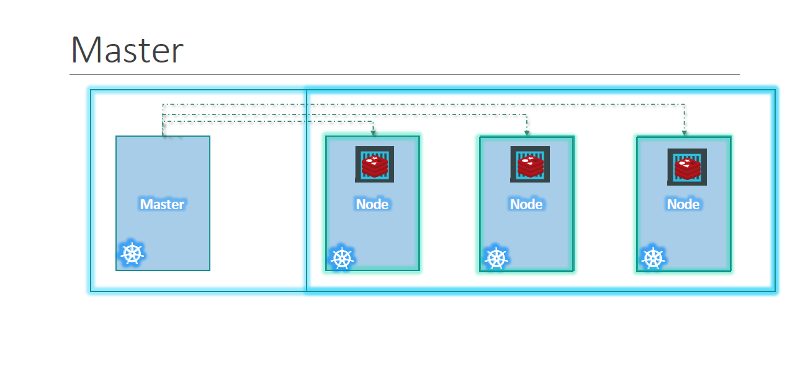

Now we have a cluster, but who is responsible for managing the cluster? Were is the information about the members of the cluster stored? How are the nodes monitored? When a node fails how do you move the workload of the failed node to another worker node? That’s were the Master comes in. The master is another node with Kubernetes installed in it, and is configured as a Master. The master watches over the nodes in the cluster and is responsible for the actual orchestration of containers on the worker nodes.

## Control plane and worker nodes (The Kubernetes Book)

As previously mentioned, a Kubernetes cluster is made of control plane nodes and worker nodes. These are Linux hosts that can be virtual machines (VM), bare metal servers in your datacenters, or instances in a private or public cloud. You can even run Kubernetes on ARM and IoT devices.

### The control plane 
A Kubernetes control plane node runs a collection of system services that make up the
control plane of the cluster. Sometimes we call them Masters, Heads or Head nodes.
However, the term “master” is no longer used.
The simplest setups run a single control plane node. However, this is only suitable
for labs and test environments. For production environments, multiple control plane
nodes configured for high availability (HA) are vital. Generally speaking, 3 or 5 is
recommended, and you should spread them across availability zones.
It’s also considered a good practice not to run user applications on control plane nodes.
This allows them to concentrate entirely on managing the cluster.
Let’s take a quick look at the different services making up the control plane. All of these
services run on every control plane node.

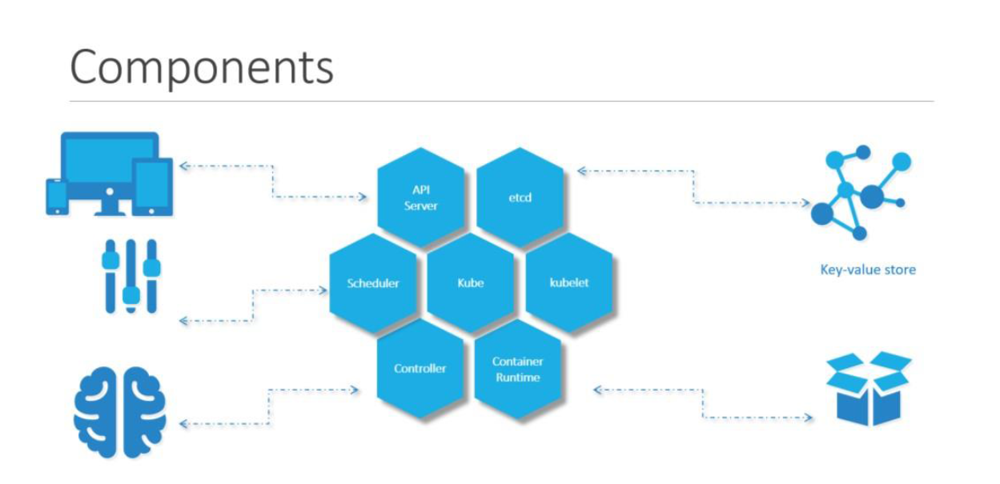

When you install Kubernetes on a System, you are actually installing the following components. 

* An API Server. 
* An ETCD service. 
* A kubelet service. 
* A Container Runtime, 
* Controllers 
* Schedulers.

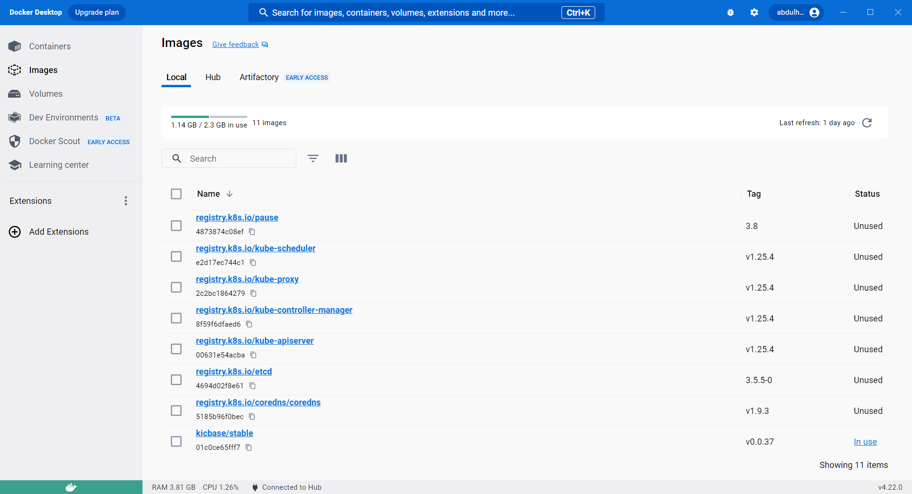

In the above figure, we have installed Minikube, Minikube is a local implementation kubernetes to learn kubernetes. All you need is Docker (or similarly compatible) container or a Virtual Machine environment, and Kubernetes is a single command away: minikube start

In our case, we have installed Minikube on a docker container, and this was made possible using docker desktop software.

On the above figure, we can see all kubernetes components listed

* registry.k8s.io/kube-apiserver
* registry.k8s.io/kube-scheduler
* registry.k8s.io/kube-controller-manager
* registry.k8s.io/kube-proxy
* registry.k8s.io/etcd
* registry.k8s.io/pause
* registry.k8s.io/coredns/coredns
* kicbase/stable:v0.0.37: is a reference to a container image, specifically one related to Minikube when it is running with its "KIC" (Kubernetes-in-Container) mode, especially when used with the Docker driver.

The API server acts as the front-end for kubernetes. The users, management devices, Command line interfaces all talk to the API server to interact with the kubernetes cluster.

kube-apiserver (More on API server)

The API server is the Grand Central station of Kubernetes. All communication, between
all components, must go through the API server. We’ll get into the detail later,
but it’s important to understand that internal system components, as well as external
user components, all communicate through the API server – all roads lead to the API
Server.
It exposes a RESTful API that you POST YAML configuration files to over HTTPS.
These YAML files, which we sometimes call manifests, describe the desired state of an
application. This desired state includes things like which container images to use, which
ports to expose, and how many Pod replicas to run.
All requests to the API server are subject to authentication and authorization. Once
these are done, the config in the YAML file is validated, persisted to the cluster store,
and changes are scheduled to the worker nodes.

Next is the ETCD key store. ETCD is a distributed reliable key-value store used by kubernetes to store all data used to manage the cluster. Think of it this way, when you have multiple nodes and multiple masters in your cluster, etcd stores all that information on all the nodes in the cluster in a distributed manner. ETCD is responsible for implementing locks within the cluster to ensure there are no conflicts between the Masters.
The scheduler is responsible for distributing work or containers across multiple nodes. It looks for newly created containers and assigns them to Nodes.

The cluster store (More on ETCD key store)
The cluster store is the only stateful part of the control plane and persistently stores the
entire configuration and state of the cluster. As such, it’s a vital component of every
Kubernetes cluster – no cluster store, no cluster.
The cluster store is currently based on etcd, a popular distributed database. As it’s the
single source of truth for a cluster, you should run between 3-5 etcd replicas for highavailability,
and you should provide adequate ways to recover when things go wrong.
A default installation of Kubernetes installs a replica of the cluster store on every control
plane node and automatically configures HA.

On the topic of availability, etcd prefers consistency over availability. This means it
doesn’t tolerate split-brains and will halt updates to the cluster in order to maintain
consistency. However, if this happens, user applications should continue to work, you
just won’t be able to update the cluster config.
As with all distributed databases, consistency of writes to the database is vital. For
example, multiple writes to the same value originating from different places need to be
handled. etcd uses the popular RAFT consensus algorithm to accomplish this.

The controllers are the brain behind orchestration. They are responsible for noticing and responding when nodes, containers or endpoints goes down. The controllers makes decisions to bring up new containers in such cases.
The container runtime is the underlying software that is used to run containers. In our case it happens to be Docker.
And finally kubelet is the agent that runs on each node in the cluster. The agent is responsible for making sure that the containers are running on the nodes as expected.

The controller manager and controllers (More on controllers)

The controller manager implements all the background controllers that monitor cluster
components and respond to events.
Architecturally, the controller manager is a controller of controllers, meaning it spawns all
the core controllers and monitors them.
Some of the core controllers include the Deployment controller, the StatefulSet
controller, and the ReplicaSet controller. Each one is responsible for a small subset of
cluster intelligence and runs as a background watch-loop constantly watching the API
Server for changes.
The goal of each controller is to ensure the observed state of the cluster matches the
desired state. More on this soon.
The following logic, implemented by each controller, is at the heart of Kubernetes and
declarative design patterns:

1. Obtain desired state
2. Observe current state
3. Determine differences
4. Reconcile differences

Each controller is also extremely specialized and only interested in its own little
corner of the Kubernetes cluster. No attempt is made to over-complicate design by
implementing awareness of other parts of the system. This is key to the distributed
design of Kubernetes and adheres to the Unix philosophy of building complex systems
from small specialized parts.

Terminology: Throughout the book we’ll use terms like controller, control loop,
watch loop, and reconciliation loop to mean the same thing.

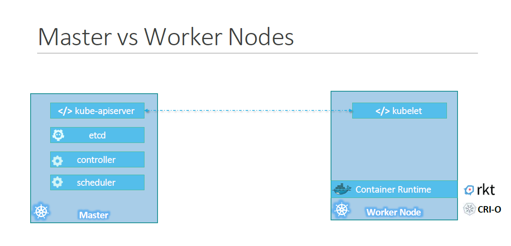

So far we saw two types of servers – Master and Worker and a set of components that make up Kubernetes. But how are these components distributed across different types of servers. In other words, how does one server become a master and the other slave?
The worker node (or minion) as it is also known, is were the containers are hosted. For example Docker containers, and to run docker containers on a system, we need a container runtime installed. And that’s were the container runtime falls. In this case it happens to be Docker. This doesn’t HAVE to be docker, there are other container runtime alternatives available such as Rocket or CRIO. But throughout this course we are going to use Docker as our container runtime.
The master server has the kube-apiserver and that is what makes it a master.

Similarly the worker nodes have the kubelet agent that is responsible for interacting with the master to provide health information of the worker node and carry out actions requested by the master on the worker nodes.

All the information gathered are stored in a key-value store on the Master. The key value store is based on the popular etcd framework as we just discussed.
The master also has the controller manager and the scheduler.
There are other components as well, but we will stop there for now. The reason we went through this is to understand what components constitute the master and worker nodes. This will help us install and configure the right components on different systems when we setup our infrastructure.

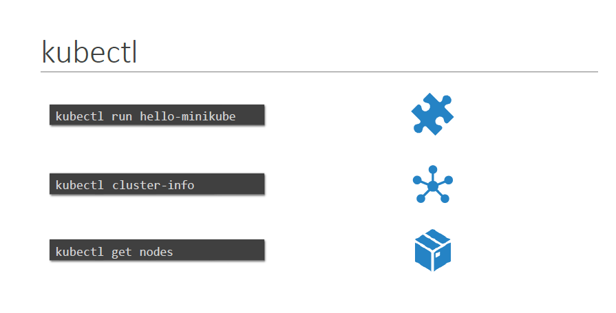

And finally, we also need to learn a little bit about ONE of the command line utilities known as the kube command line tool or kubectl or kube control as it is also called. The kube control tool is used to deploy and manage applications on a kubernetes cluster, to get cluster information, get the status of nodes in the cluster and many other things.
The kubectl run command is used to deploy an application on the cluster. The kubectl cluster-info command is used to view information about the cluster and the kubectl get pod command is used to list all the nodes part of the cluster. That’s all we need to know for now and we will keep learning more commands throughout this course. We will explore more commands with kubectl when we learn the associated concepts.
For now just remember the run, cluster-info and get nodes commands and that will help us get through the first few labs.

